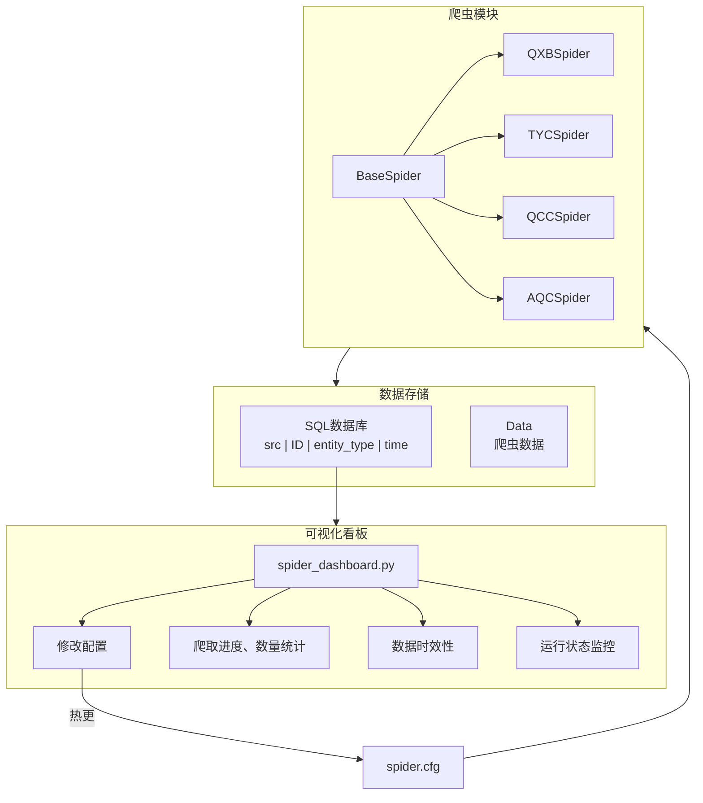

# FinanceKG Spider 架构

## 系统架构图

## 核心模块说明

### 爬虫源
- **爬虫**: 启信宝、天眼查、企查查、爱企查等
- **sql**: src - ID - entity_type - time
- **可视化看板**: 各个爬虫的进度可视化：爬了多少（公司多少，人物多少），爬的数据时效性如何，爬虫的近期运行状态如何（按天的爬虫数是否有显著变化）

### 关键特性

1. **热更新配置**: 修改spider.cfg即可实时生效，无需重启爬虫
2. **线程安全**: 使用文件锁和缓冲区锁确保并发安全
3. **进度监控**: spider_dashboard.py可视化爬虫运行状态和数据统计
4. **数据时效性**: 通过sql记录数据时间戳，实现数据时效性监控
5. **配置爬虫关键字种子**: 通过spider.cfg配置爬虫关键字种子 

