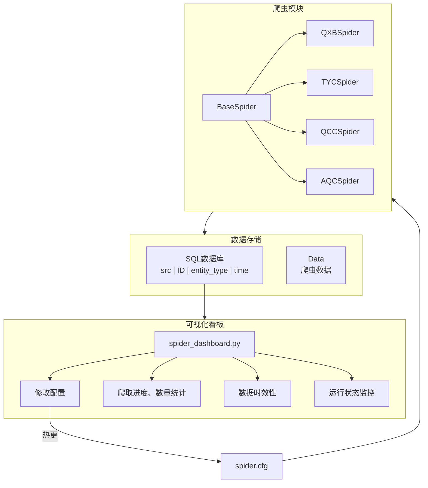

# FinanceKG Spider - 天眼查爬虫系统

一个功能强大的天眼查爬虫系统，整合了公司搜索和投资信息爬取，配合 Web 仪表板进行关键词管理和搜索操作。


## 系统架构图



## ✨ 核心功能

| 功能 | 描述 |
|------|------|
| 🔍 **公司搜索** | 按关键字搜索公司信息，自动分页爬取，保存为 JSON |
| 💼 **投资信息** | 获取公司对外投资信息，自动提取被投资公司数据 |
| 🎨 **交互** | 用户友好的界面，支持上传关键词文件，自动校验格式、编码、数量 |
| 📊 **仪表盘** | 可视化爬取数据，包括公司数量、人物数量、数据时效性等 <br>(**sql**: src - ID - entity_type - time) | 


## 🚀 快速开始

### 1. 安装依赖
```bash
pip install requests loguru flask werkzeug
```

### 2. 启动仪表板
```bash
python run.py
```
访问 `http://localhost:5000`

### 3. 上传关键词
- 访问 `/tyc/keywords`
- 上传 `.txt` 文件（UTF-8 编码，每行一个）
- 支持拖拽上传，可下载示例文件

### 4. 开始搜索
- 访问 `/tyc/search`
- 配置最大爬取页数（可选）
- 点击"搜索"，实时显示进度

## 📁 项目结构

```
├── run.py                        # 启动脚本
├── spider_dashboard.py           # Web 仪表板（关键词管理+搜索）
├── tyc/spider.py                 # 天眼查爬虫（搜索+投资信息）
├── base_spider.py                # 基础爬虫类
├── spider.cfg                    # 爬虫配置
├── data/
│   ├── tyc_data/                 # 爬取的公司数据（base_info_*.json）
│   └── tyc_keywords/             # 关键词文件存储
└── logs/spider.log               # 爬虫日志
```

## ⚙️ 配置

编辑 `spider.cfg` 中的 `TYCSpider` 部分：

```json
{
    "TYCSpider": {
        "api_base_url": "https://capi.tianyancha.com/...",
        "headers": {
            "X-Auth-Token": "YOUR_TOKEN",      // 需要更新
            "X-Tycid": "YOUR_ID"               // 需要更新
        },
        "data_direc": "../data/tyc_data/",
        "keywords_direc": "../data/tyc_keywords/",
        "keywords_file": "keywords.txt",
        "request_sleep_seconds": 3             // 请求间隔（秒）
    }
}
```

## 🔑 获取认证信息

1. 打开 https://www.tianyancha.com/
2. 按 F12 打开开发者工具
3. Network 标签 → 任何 API 请求
4. Headers 中查找 `X-Auth-Token` 和 `X-Tycid`
5. 复制更新到 `spider.cfg`

## 📊 Web 仪表板

### 路由列表
| 路由 | 功能 |
|------|------|
| `/` | 首页导航 |
| `/tyc/keywords` | 关键词管理页面 |
| `/tyc/keywords/api` | 获取关键词列表 API |
| `/tyc/search` | 搜索公司页面 |

### 关键词文件要求
- **格式**：`.txt` 纯文本
- **编码**：UTF-8
- **内容**：每行一个关键词
- **大小**：1-10,000 个关键词，单个文件 ≤16MB
- **校验**：自动验证格式、编码、非空、数量限制

### 示例关键词文件
```
CVTE
百度
阿里
腾讯
小米
```

## 🐍 天眼查——命令行使用

### 搜索公司
```python
from tyc.spider import TYCSpider

spider = TYCSpider()
result = spider.search_companies("CVTE", max_page=5, save_to_file=True)
print(f"找到 {result['total_companies']} 家公司")
spider.close_session()
```

### 爬取投资信息
```python
spider = TYCSpider()
investments = spider.get_all_investment("1391758803", save_to_file=True)
spider.close_session()
```

### 运行测试
```bash
python -m tyc.spider -t search      # 测试搜索
python -m tyc.spider -t investment  # 测试投资爬取
```

## 📝 数据存储

### 公司基本信息 (base_info_{id}.json)
```json
{
    "id": "3478715717",
    "name": "视源电子股份有限公司",
    "legalRepresentative": "...",
    "registeredCapital": "...",
    "establishDate": "...",
    ...
}
```
位置：`data/tyc_data/base_info_{id}.json`

### 投资信息 (investments_{company_gid}.json)
位置：`data/tyc_data/investments_{company_gid}.json`

## 📖 API 返回格式

### 搜索结果
```python
{
    "keyword": "CVTE",
    "total_companies": 42,
    "total_pages": 3,
    "company_ids": ["1", "2", ...],
    "timestamp": "2026-01-30T10:30:45.123456"
}
```

### 关键词列表 API
```python
{
    "exists": true,
    "keywords": ["CVTE", "百度", ...],
    "count": 10,
    "file_path": "/path/to/keywords.txt",
    "file_size": 1024,
    "last_modified": "2026-01-30T10:30:45.123456"
}
```

## ❓ 常见问题

| 问题 | 解决方案 |
|------|--------|
| 搜索失败 | 检查 `X-Auth-Token` 是否过期，更新 `spider.cfg` |
| 文件上传失败 | 确保文件是 UTF-8 编码的 `.txt` |
| 找不到数据 | 检查 `data/tyc_data/` 目录 |
| 查看详细日志 | 打开 `logs/spider.log` |
| 恢复中断爬取 | 脚本自动跳过已存在文件，继续爬取新数据 |

## 📈 性能建议

| 参数 | 推荐值 |
|------|--------|
| request_sleep_seconds | 3 秒 |
| 单页关键词数 | 20 (搜索) / 100 (投资) |
| 请求超时 | 15 秒 |
| 最大页码检查 | 1000 页 |

## 🔍 日志

爬虫日志保存在 `logs/spider.log`，查看实时日志：
```bash
tail -f logs/spider.log
```

## 📄 许可证

仅供学习和研究使用。使用前请确保已阅读并同意天眼查的使用条款。

---

**版本**：1.0  
**最后更新**：2026-01-30