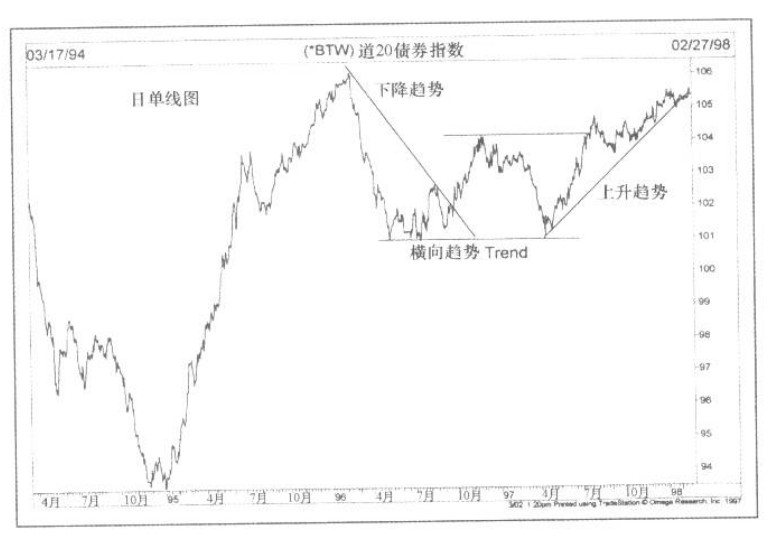
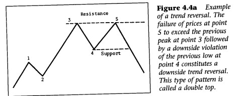
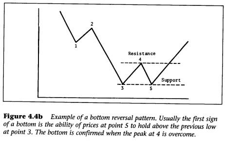
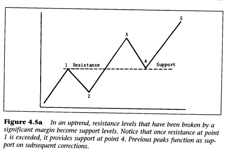
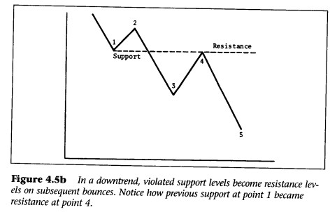

## 量化学习
    ```https://dn710707.ca.archive.org/0/items/JohnJ.MurphyTechnicalAnalysisOfTheFinancialMarkets/John_J._Murphy_-_Technical_Analysis_Of_The_Financial_Markets.pdf```

1. 技术分析概念

- 合理性基础
    
  - Market action discounts everything
  - Prices move in trends: a trend in motion is more likely to continue than to reverse 
  - History repeats itself

- remark: **stock** vs **futures** vs **commodity**
    - price structure in futures is more complicated
    - futures contracts have expiration dates
    - futures have lower margin requirements
    - time frame is much shorter
    - timing is everything in futures trading
    - stock analysis is based heavily on the movement of the broad market averages
    - futures traders rely heavily on short term indicators
    - stock traders rely more on sentiment indicators and flow of funds
      - odd lotters 散户
      - mutual funds 公募
      - floor specialist 做市商

| 交易维度 | 期货交易员（Futures） | 股票交易员（Stock） |
| :--- | :--- | :--- |
| **核心痛点** | 容错率极低、害怕方向瞬间反转  | 害怕选错赛道、害怕没有资金关注（死水一潭）|
| **主要观察对象** | 速度、位置、微观筹码  | 共识、风口、资金堆积 |
| **首选指标类型** | 短周期衍生指标（MOM、BIAS、MACD）、订单流 | 资金流向（Money Flow）、换手率、情绪偏离度 |
| **量化策略逻辑** | 基于高频/日内均值回归、动量突破 | 基于多因子选股、资金跟庄、行业轮动、事件驱动 |


2. Trend

- 趋势，一定要在有趋势的市场才能使用。横向趋势、或者说没有趋势的时候，一定不要交易。




- Dow Theory

  - trend in Dow Theory: a series of higher highs and higher lows in an uptrend, and lower highs and lower lows in a downtrend.

  - basic tenet
    - The averages discount everything
    - The market has three trends: primary (more than a year), secondary (three weeks to three months, represents the corrections in the primary trend), and minor (less than three weeks)
    - Major trends have three phases: accumulation, public participation, and distribution
    - The averages must confirm each other: the industrials and the rail averages must both reach new highs or lows to confirm a trend.
    - Volume must confirm the trend: volume should increase in the direction of the primary trend.
      - 注意：量是第二位的，道氏理论仍然以收市价格为B/S信号
    - A trend is assumed to be in effect until it gives definite signals that it has reversed.

- support & resistance

  - support: troughs (or reaction lows), where buying interest is strong enough to overcome selling pressure.
  - resistance: peaks (or reaction highs), where selling interest is strong enough to overcome buying pressure.
  - TREND:
    - for an **uptrend**, each successive trough should be higher than the previous trough, and each successive peak should be higher than the previous peak.
    - for a **downtrend**, each successive peak should be lower than the previous peak, and each successive trough should be lower than the previous trough.
  - TREND reversal:
    
    
  - how SUPPORT and RESISTANTCE reverse their roles
    
    
  - Importance of support & resistance
    - the amount of time spent there
    - volume
    - how recently the trading took place
    - the distance prices traveled away from support or resistance increased the significance
  - **round numbers** as support & resistance

- trendlines
  

- 概念：
  - [做市商](learn_notes/1.做市商.md)。
  - [MACD KDJ RSI](learn_notes/2.MACD_KDJ_RSI.md)