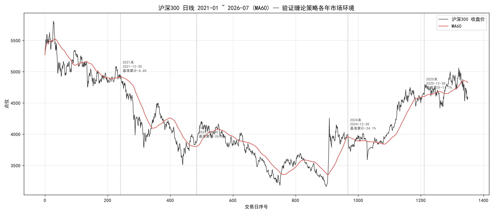
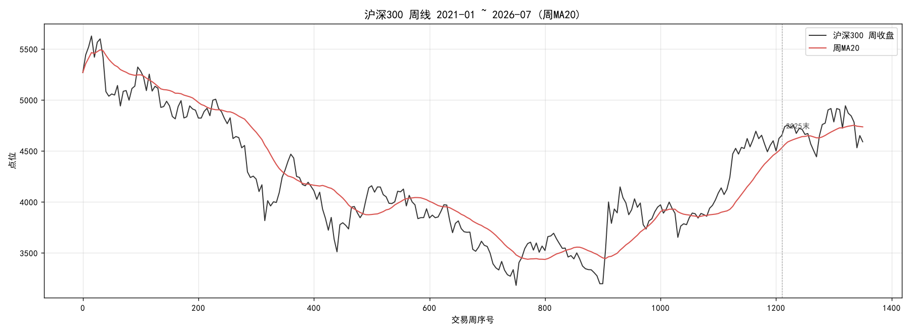

# 基于缠论的量化程序改进

```
joinquant
|- s3_v2.py      // v2.0 30分钟直买版（趋势进攻型）
|- s3_v3.py      // v3.3 三硬伤修复版（震荡防御型）
|- s3_v4.py      // v4.4 三分状态+永久持仓+货币ETF（当前主版本）
|- s3_v4-2.py    // v4.0 二分状态早期版（对照实验，已弃用方向）
```

对应的测试log如下：

```
joinquant
|- jqlog/s3
    |- v2_log.txt / v2_overall_result.csv / v2_transaction.csv
    |- v3_log.txt / v3_overall_result.csv / v3_transaction.csv
    |- v4_log.txt / v4_overall_result.csv / v4_transaction.csv
    |- v4-2_log.txt / v4-2_overall_result.csv / v4-2_transaction.csv
// 回测区间均为 2021-01-04 ~ 2026-07-31，基准沪深300
// 注：log中挂单价含滑点非成交价，transaction.csv的成交价才是实际
```

## basic telnet（策略制定三问，制定前先想清楚）

① 因子假阳性 / 因子组合假阳性

检验金标准是样本外 + walk-forward + 跨时段/跨市场稳健，只在单一历史区间好的因子≈巧合；还要警惕"因子经济学含义漂移"——同一因子在不同 regime 下含义会变（低波在熊市=防御、在牛市=踏空）。

② 逻辑与因子的先后顺序

逻辑优先但须防"逻辑自洽却错误"——故事顺≠事实（"散户会割肉"但割肉位置未必是你以为的），逻辑与数据必须互验；且逻辑要建立在可证伪假设上（能说出"若 X 发生则策略该亏"），不可证伪的逻辑等于没逻辑。

③ 如何验证有效的策略

(1) 赚谁的钱：四类对手盘——风险溢价 / 行为偏差 / 信息偏差 / 制度摩擦（+流动性提供）。关键看对手盘可持续性：散户行为偏差随机构化衰减（有生命周期）、风险溢价/制度摩擦更持久、信息优势是军备竞赛（被超就死）。讲不清对手盘的策略上线必亏。
(2) 适用条件：任何 edge 都有边界，要把"适用条件"显式写进代码。
(3) 失效信号须预设并机械执行：滚动 Sharpe<0 持续 N 月、因子 IC 衰减、对手盘结构变化、拥挤度上升、波动率结构突变。触发即停，宁可错过不在失效中亏；区分"暂时回撤"与"结构失效"只能靠预设规则，不能靠事后判断。

---

## 四个脚本的异同

### 代码特征对照

| 维度 | v2.0 (s3_v2) | v3.3 (s3_v3) | v4.0二分 (s3_v4-2) | v4.4 (s3_v4) |
|---|---|---|---|---|
| 身份 | 趋势进攻型 | 震荡防御型 | 二分自适应(早期) | 三分自适应(当前) |
| 盘前入口 | 2闸(回踩+月多头) 上限300 | 3闸(+日线确认+120日位置) 上限40 | trend2闸/range3闸 | trend2闸/range3闸/bear不建池 |
| 状态切换 | 无(固定V2风格) | 无(固定V3.3风格) | trend/range二分 | trend/range/bear三分·慢进快出 |
| 仓位 | 等权近满仓 | 比例×20%留30%现金 | trend等权/range比例 | trend等权封顶30%/range比例/bear空仓 |
| 止损 | -5%硬+MA20+均线转弱 | -8%硬+结构止损+利润棘轮 | 按模式切换 | 按模式切换(同左)+跨模式MA兜底 |
| 大盘闸 | 有(沪深300<60d不买) | 无 | 无(靠trend/range切换) | 无(靠bear空仓) |
| 熔断 | 未生效 | 生效(连亏5冻结8天) | 仅range | 仅range |
| 永久持仓 | 无 | 无 | 无 | 有(中行PB<0.8/长电PE<20各5000) |
| 现金管理 | 无 | 无 | 无 | 货币ETF 511880 |

### 实测交易统计（2021-01~2026-07 全期）

| 版本 | 卖出笔数 | 胜率 | 总平仓盈亏(元) | 均盈亏(元/笔) | 全期策略收益 | 全期超额 |
|---|---|---|---|---|---|---|
| v2 | 441 | 46.9% | -8267 | -19 | -39.9% | -31.9% |
| v3 | 149 | **25.5%** | -5694 | -38 | -17.0% | -6.9% |
| v4 | 531 | 41.6% | -5146 | -10 | -14.2% | -1.8% |
| v4-2 | 640 | 39.8% | -10174 | -16 | -62.4% | -57.4% |
| 基准 | — | — | — | — | -11.7% | 0 |

**第一条核心发现：所有版本的平仓盈亏都是负的，胜率全部 < 50%。**
- 即使是超额最好的 v4，选股本身也在亏钱（总平仓盈亏 -5146 元）。
- v3 胜率仅 25.5%（4 笔里才 1 笔赚），但全期超额反而最稳之一——说明它的超额**根本不来自选股**。

---

## 验证 + 改进

### 一、逻辑是什么？赚的什么钱？

**结论：这个策略不赚"选股 alpha"，赚的是"熊市择时避跌"的钱——本质是风险溢价。**

证据：
1. **选股是负 alpha**：四个版本胜率 25%~47% 全部 < 50%，平仓总盈亏全部为负。缠论背驰买点选出的票，平均下来是亏的。
2. **超额全部来自"少跌"而非"多赚"**：v3/v4 在 2022-2024 基准大跌时超额 +11~+33，但这是"基准跌 34% 我只跌 12%"的相对优势，不是"我涨了多少"。
3. **v3 的极端案例印证**：胜率 25.5%、均亏 -38/笔，但 2022-2023 超额 +29/+33。它能跑赢基准完全靠"少做（149 笔最少）+ 轻仓 + 严入口避开大亏票 + 熊市不在场内"。这是纯粹的**择时防御**，不是选股。

**对手盘是谁？** 不是被你选中的个股的对手方，而是"在熊市里满仓扛着的人"。你赚的是他们多跌的那部分——他们为什么愿意亏？因为：
- **风险溢价**：他们在熊市满仓承担了你回避的风险（你空仓/轻仓 = 不承担）。
- **行为偏差**：他们在下跌中死扛不卖（处置效应），你用空仓避开了。
- 你不是"选到了好票"，你是"在坏时候没在场"。这是两种完全不同的 edge。

**这个认知很关键**：策略的 edge 在"择时避跌"，不在"选股"。所以改进方向应该围绕"什么时候不该在场"，而不是"怎么选更好的票"。

### 二、分别适用什么市场？大盘环境验证

#### 分年度超额收益（累计，%）

| 年份 | 基准(沪深300) | v2超额 | v3超额 | v4超额 | v4-2超额 | 市场环境 |
|---|---|---|---|---|---|---|
| 2021 | -5.2 | -10.7 | **+11.1** | -1.4 | +0.1 | 核心资产见顶分化，结构市 |
| 2022 | **-25.7** | +6.7 | **+29.2** | **+25.8** | +5.5 | 系统性熊市(俄乌+加息+疫情) |
| 2023 | **-34.2** | +5.8 | **+33.1** | **+33.6** | -15.1 | 继续大跌(最差年) |
| 2024 | **-24.5** | -21.9 | +11.5 | **+16.4** | -47.5 | 先跌后924反弹 |
| 2025 | -11.2 | -42.6 | -2.4 | -7.2 | -57.4 | 结构市小跌 |
| 2026H1 | -12.7 | -31.9 | -6.9 | -1.8 | -57.4 | 震荡小跌 |





**第二条核心发现：策略只在"基准大跌的熊市"有效，基准小跌/横盘时全部失效。**

- **2022-2024（基准 -24%~-34% 大跌）**：v3/v4 超额 +11~+33，显著有效。bear 空仓 + range 轻仓避开了主跌段。
- **2021（基准 -5% 小跌）**：v3 超额 +11（还行），v4 超额 -1.4（接近持平），v2 超额 -10.7（挨打）。
- **2025-2026（基准 -11%~-12% 小跌）**：**全部版本超额为负**。没有大跌可避，选股的负 alpha（均亏 -10~-38/笔）暴露，策略反而拖累。

**为什么 v2/v4-2 在 2024-2025 崩溃？**
- v2：满仓等权 + -5% 紧止损 + 441 笔高频交易。2024-2025 没有大跌可避，满仓频繁触发 -5% 扫损（扫损税），累计 -42.6% 超额。
- v4-2：v4.0 二分版无 bear 状态，2023 后熊市反弹误判 trend 满仓吃跌，640 笔高频 + 总亏 -10174，崩溃。
- 共性：**交易频次高 + 选股负 alpha + 无大跌可避 = 高频磨损崩溃**。

**适用条件总结**：
- ✅ 有效：基准年跌幅 ≥ 20% 的熊市/系统性行情（2022-2024）
- ⚠️ 持平：基准小跌 5% 左右（2021）
- ❌ 失效：基准小跌/横盘/结构市（2025-2026），无大跌可避

### 三、什么信号会导致策略失效？失效逻辑？如何验证？

**失效逻辑（已用数据验证）**：
策略的 edge 是"熊市避跌"。当市场进入"无大跌可避"的状态（基准横盘或小跌），避跌价值归零，而选股的负 alpha（胜率<50%、均亏）持续消耗 → 策略从"少跌"变成"多跌"。

**失效信号（建议预设并机械执行）**：

| 信号 | 阈值 | 含义 | 动作 |
|---|---|---|---|
| 基准滚动波动率低位 | 沪深300 近60日年化波动率 < 12% | 无大跌，避跌价值低 | 降仓至轻仓/空仓 |
| 基准站上 MA60 且 MA60 上行 + 低波动 | trend 确认 + 波动收敛 | 趋势但非恐慌市 | 轻仓参与或不做 |
| 策略滚动超额 Sharpe | 近 60 日 < 0 持续 | edge 消失 | 暂停开新仓 |
| 交易频次异常升高 | 月度卖出笔数 > 历史均值×1.5 | 高频磨损 | 触发冷静期 |
| 基准近 60 日跌幅 | > -8%（还在跌） | 熊市仍在，edge 还在 | 继续执行 |

**验证方式**：把 2025-2026 的每日状态回放，看"基准波动率<12% 且 基准未大跌"的时段，策略是否在亏钱——如果是，这个信号能有效过滤失效期。

**关键原则**：失效时"倾向于不做"——宁可错过，不要在失效中亏钱。当前 v4 在 2025-2026 仍开仓（range 模式交易），这就是失效期还在做导致 -7.2% 超额。**应该在"无大跌可避"时强制降仓或空仓**，而不只是 bear 状态。

---

## 改进方向（按优先级）

### P0：承认策略本质是"熊市防御"，重构状态判定
当前三分（trend/range/bear）只在大跌时 bear 空仓。但 2025-2026 是"小跌+结构市"，被判 range 仍交易导致亏损。
- **改进**：加第四个维度"低波动结构市"（基准近60日波动率<阈值 且 跌幅浅）→ 强制轻仓或空仓。
- 或：把 range 拆成"range_active"（有避跌价值，轻仓）和"range_quiet"（无避跌价值，空仓）。

### P1：降低交易频次，减少磨损
v2/v4-2 高频（441/640笔）+ 选股负 alpha = 崩溃。v3 低频（149笔）反而最稳。
- **改进**：收紧入口（即使是 trend 也别太宽）、提高单笔门槛、加入"日内已交易则不再追加"的冷静。
- 目标：把 v4 的 531 笔降到 300 笔以下。

### P2：提升选股胜率（最难，可能无解）
胜率 25-47% 是策略根本缺陷。缠论背驰在A股散户市假信号率高。
- **改进**：背驰信号叠加更多确认（量能配合、主力资金流向、板块共振）；或承认选股无edge，纯做择时（只持有货币ETF+少量永久持仓，熊市空仓）。
- 若验证选股确实无 alpha，P2 转向"纯择时+永久持仓"路线。

### P3：失效信号机制化
把第三节的失效信号写成代码（盘前检查滚动波动率/超额Sharpe），触发即降仓或空仓，避免主观判断。

### P4：永久持仓+货币ETF的再评估
- 永久持仓（中行/长电）是"选股"性质，但锁仓不交易，避开了磨损——可保留作为底仓。
- 货币ETF现金管理已就位，bear/quiet 期闲余有收益——保留。

---

## 一句话总结

这个策略的 edge 不在选股（选股是负的），在"熊市不在场"。它 2022-2024 有效是因为基准大跌它避开了，2025-2026 失效是因为没大跌可避、选股的负 alpha 暴露。**改进的核心不是"选更好的票"，而是"更精准地判断什么时候不该在场"**——把"无大跌可避"的时段也纳入空仓/轻仓，而不是只在 bear 状态才停手。
