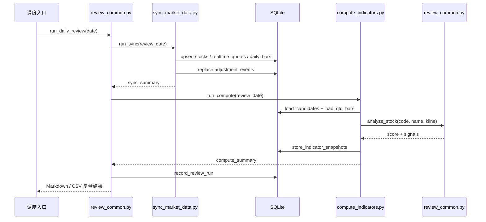

# 选股策略

## 文档目的

本文档基于当前 `stock` 目录下的日复盘实现整理，描述每日选股任务的业务思路、关键筛选条件、评分逻辑以及主流程 UML，便于后续维护、调参与扩展。

当前实现的主入口是：

- `review_common.py`：编排每日任务，输出 Markdown 和 CSV 复盘结果。
- `sync_market_data.py`：同步股票池、实时行情、K 线和复权事件到 SQLite。
- `compute_indicators.py`：从 SQLite 读取候选股，计算技术指标并生成信号。
- `backtest.py`：基于历史日线回放信号，并按当前交易规则进行事件回测与组合资金曲线评估。

## 选股思路

### 1. 先做交易宇宙收缩

系统不会直接对全市场做技术评分，而是先把股票池收缩到更适合短线或波段跟踪的一组标的：

1. 从全市场 A 股列表读取股票代码、名称、板块信息。
1. 剔除 ST 与 `*ST` 股票。
1. 默认仅保留主板沪市、主板深市、中小板。
1. 使用实时行情先做流动性筛选，再结合流通市值做约束与惩罚。

当前默认过滤阈值：

| 维度 | 条件 |
| --- | --- |
| 板块范围 | 主板-沪（60）、主板-深（00）、中小板（002/003） |
| ST 过滤 | 必须为非 ST |
| 流动性初筛 | 实时流动性占流通市值比例 `>= 2%` |
| 流通市值 | `>= 20` 亿，日复盘主流程默认保留超大市值，但在评分阶段对 `> 2000` 亿个股追加扣分 |

这一步的目标不是直接选出买点，而是先排除流动性不足、题材风格不匹配、或者交易噪声较大的标的。

### 2. 再校正历史行情质量

进入候选池的股票会同步两套行情：

1. 原始日线。
1. 前复权日线。

同时系统会拉取前复权因子事件和分红明细，对比本地数据库中的复权事件；如果发现复权因子发生变化，就触发该股票的前复权历史全量重刷。

这一步的核心目的是避免技术指标因为复权不一致而失真，尤其是均线金叉、60 日高点距离、RSI 等指标都会受到历史价格序列质量影响。

### 3. 最后只对“趋势刚形成”的股票打分

策略不是做低吸埋伏，也不是追高强趋势，而是偏向寻找“刚完成启动确认”的标的。核心特征是：

1. 短期均线已经上穿中期均线。
1. 金叉发生时间不能过久，系统会对金叉年龄做 20 日衰减，避免追已经走远的趋势。
1. 需要一定的量能配合。
1. 价格不能偏离中期均线过大。
1. RSI 不能过热。
1. 若形成多头排列、较强均线夹角、临近前高的强二次金叉，或者处于合适的流动性区间，会获得更高评分。

从实际风格上看，这是一套“主板中等流动性股票 + 近期金叉 + 放量确认 + 不追过热 + 偏好缩量回踩后再启动”的趋势确认策略。

## 技术筛选条件

### 硬性淘汰条件

股票只要命中以下任一条件，就不会进入最终信号列表：

| 条件 | 说明 |
| --- | --- |
| K 线不足 | 历史数据不足以支撑均线和 RSI 计算 |
| `MA5 <= MA20` | 尚未形成短中期多头关系 |
| 未识别到近 20 日内有效金叉 | 不是当前关注的启动阶段，且基础分会随金叉年龄衰减 |
| `RSI > 75` | 动能过热 |
| 缩量回踩后未出现有效放量 | 若已识别到缩量下跌结构，但当前成交量仍弱于最近一次缩量回踩量能，则直接淘汰 |
| `float_mv_yi < 20` | 20 亿以下流通市值一票否决 |

### 金叉类型识别

系统把金叉分成三类：

| 类型 | 判定逻辑 | 含义 |
| --- | --- | --- |
| 首次金叉 | 近 20 日内发生 `MA5` 上穿 `MA20`，且向前回看至多 30 日未识别到对应死叉回踩后的再转强 | 趋势初启，优先级最高 |
| 二次金叉 | 近 20 日内发生金叉，且向前追溯到最近一段死叉后再次转强 | 二次攻击，强于普通回抽 |
| 高位金叉 | 金叉虽成立，但当前价距离近 60 日低点涨幅已超过 30% | 趋势已走出较大空间，降低权重 |

金叉基础分不会一刀切地按时间失效，而是会在 20 个交易日窗口内按指数方式衰减，越新的金叉分值越高。

对应实现公式如下：

$$
decay(cross\_age)=
\begin{cases}
1, & cross\_age \le 0 \\
0.1, & cross\_age \ge 20 \\
0.1^{cross\_age/20}, & 0 < cross\_age < 20
\end{cases}
$$

其中 `cross_age` 表示最近一次有效金叉距离当前 K 线末端的交易日数。三类金叉的基础分分别为 50、35、10，实际入账基础分为：

$$
base\_score=\max(1, \lfloor raw\_weight \times decay(cross\_age) \rfloor)
$$

另外，若 `cross_age > 20`，则该金叉直接失效，不再进入候选信号。

### 趋势与动能辅助条件

除金叉外，还会进一步衡量下列维度：

| 维度 | 判定逻辑 | 作用 |
| --- | --- | --- |
| 多头排列 | `MA5 > MA10 > MA20 > MA60` | 判断中短期趋势是否协调 |
| 缩量回踩 | 追溯近 60 天，从最近前高之后开始统计；至少出现 2 次下跌日，且成交量低于 60 天均量的 `80%` 且低于前一日 | 判断回调抛压是否收敛 |
| 爆发倍量 | 若已识别到缩量回踩，则按“当前成交量 / 最近一次缩量回踩最大成交量”额外加分，最高加 30 分 | 判断从缩量整理转向放量启动的力度 |
| 量能 | 当日成交量对比前 20 日平均成交量，量比越大加分越多；只在收阳且收盘高于前一日时计入趋势确认 | 判断上涨是否被资金确认 |
| 突破放量约束 | 若当前信号依赖前面的缩量回踩结构，则当前成交量至少不能弱于最近一次缩量回踩最大量能，否则直接过滤 | 确认金叉突破不是弱反弹 |
| 均线夹角 | 对 `MA5` 与 `MA20` 的斜率差做角度近似 | 判断趋势抬升速度 |
| RSI | 优先 40 到 60 区间 | 偏好健康强势而不是极端超买 |
| 乖离率 | 优先小于 5%，可接受小于 10%，超过 10% 后按二次方形式递增扣分 | 控制追高风险 |
| 距离 60 日高点空间 | 作为观察指标输出 | 便于人工判断上方压力 |
| 强二次金叉 | 二次金叉且距离前高 `< 10%`、量比 `>= 1.8`、RSI `<= 65`、乖离 `<= 7%` | 识别临近突破位的强确认形态 |
| 流动性评分 | 按 `amount_wan / (float_mv_yi * 100)` 映射为流动性不足、起步、良好、偏热、过热等标签并计分 | 避免低流动性，也不盲目追逐过热个股 |
| 超大市值惩罚 | 流通市值超过 2000 亿后按对数方式逐步扣分 | 降低超大盘股对趋势评分的误导 |

几个关键公式如下：

1. 爆发倍量定义：

$$
breakout\_multiplier=\frac{volume_{today}}{\max(shrinking\_down\_volumes)}
$$

若已识别到缩量回踩且 `breakout_multiplier < 1`，则该信号直接淘汰；否则额外加分为：

$$
breakout\_bonus=\min(\lfloor (breakout\_multiplier-1) \times 15 \rfloor, 30)
$$

2. 乖离惩罚：当 `bias > 10%` 时，先定义超额乖离

$$
excess\_bias=bias-0.10
$$

对应扣分为：

$$
bias\_penalty=\left\lfloor -0.08 \times (excess\_bias \times 100)^2 \right\rfloor
$$

这意味着乖离越远离 10%，惩罚会按二次方加速增大。

3. 超大市值惩罚：当 `float_mv_yi > 2000` 时，按照对数方式逐步扣分：

$$
mv\_penalty=-\max\left(1, \left\lfloor 12 \times \log_{10}\left(\frac{float\_mv\_yi}{2000}\right) \right\rfloor \right)
$$

4. 流动性评分先定义：

$$
liquidity\_ratio\_pct=\frac{amount\_wan}{float\_mv\_yi \times 100}
$$

其分段规则与代码一致：

- 当 `ratio < 2` 时，给负分，且越低扣分越重。
- 当 `2 <= ratio < 5` 时，按线性插值给 `0` 到 `8` 分。
- 当 `5 <= ratio <= 15` 时，按线性插值给 `8` 到 `20` 分。
- 当 `15 < ratio <= 30` 时，按线性插值从 `20` 分递减到负分区间。
- 当 `ratio > 30` 时，继续追加过热惩罚。

### 去重修正与前高压力

当前策略默认不再直接使用原始累计分，而是使用一套 `dedup` 评分：

1. `金叉类型` 作为基础分保留。
1. `趋势确认类信号`（缩量回踩、量能、多头排列、均线夹角）做分组封顶，避免重复加分把同一类趋势特征无限放大。
1. `位置质量类信号`（RSI、乖离率）也做分组封顶。
1. `流动性` 与 `市值惩罚` 也独立成组参与 `dedup` 汇总。
1. 对距离 60 日高点过近的标的追加前高压力惩罚。
1. 若前面存在有效缩量下跌结构，则要求信号当日成交量至少不低于最近一次缩量回踩最大量能，否则直接过滤。
1. 对“临近前高的强二次金叉”会保留额外基础分，并把前高压力过近的惩罚从 `-15` 放宽到 `-5`。
1. `dedup` 模式下设置最低置信分门槛，低于门槛的信号不进入最终名单。

当前默认参数：

| 项目 | 当前值 |
| --- | --- |
| 趋势确认分组封顶 | 50 |
| 位置质量分组封顶 | 10 |
| 市值分组封顶 | 30 |
| 流动性分组封顶 | 20 |
| 前高压力过近 | 距离 60 日高点空间 `< 10%`，减 15 分 |
| 强二次金叉的前高压力过近 | 距离 60 日高点空间 `< 10%`，减 5 分 |
| 前高压力偏大 | 距离 60 日高点空间 `< 20%`，减 8 分 |
| `dedup` 最低置信分 | 85 |

## 评分规则

最终结果按综合评分倒序排序。当前代码中的主要加分项如下：

| 信号 | 分值 |
| --- | --- |
| 首次金叉 | 50 |
| 二次金叉 | 35 |
| 高位金叉 | 10 |
| 临近前高的强二次金叉 | 20 |
| 多头排列 | 15 |
| 60 日内两次缩量下跌 | 30 |
| 轻度放量（量比 `>= 0.7`） | 5 |
| 放量突破（量比 `>= 1.5`） | 25 |
| 温和放量（量比 `>= 1.0`） | 15 |
| 强放量突破（量比 `>= 2.0`） | 35 |
| 爆发倍量 | `min(int((爆量倍数 - 1.0) * 15), 30)` |
| 强势夹角（角度 `> 15°`） | 20 |
| 温和夹角（角度 `> 5°`） | 10 |
| RSI 健康（40 到 60） | 10 |
| RSI 可接受（30 到 75） | 5 |
| 低乖离（`< 5%`） | 10 |
| 乖离适中（`< 10%`） | 5 |
| 流动性起步 | 0 到 8 |
| 流动性良好 | 8 到 20 |
| 流动性偏热 | 20 到 -10 之间递减 |
| 流动性不足 / 过热 | 负分 |

可以把这套打分理解为：

1. 金叉类型决定基础优先级。
1. 缩量回踩、量能、夹角、多头排列、爆发倍量决定趋势是否被确认，但在 `dedup` 模式下会做趋势确认分组封顶。
1. RSI、乖离率、前高压力决定当前位置是否适合介入。
1. 流动性和超大市值惩罚负责把“能交易”和“值得追”这两个约束纳入最终分数。

## 回测交易规则

当前回测默认使用以下交易规则：

| 规则 | 当前值 |
| --- | --- |
| 买点 | 信号当日收盘价，尾盘买入 |
| 止损 | 本金回撤 10% |
| 出场 | 不再使用“浮盈回撤 30% 动态止盈”；当前实现是后续任一交易日收盘价跌破 `MA20` 即按当日收盘价出场 |
| 止盈后冷却 | 若因跌破 `MA20` 出场且该笔交易为盈利，则同一只股票自卖出日开始 30 天内不再买入 |
| 持仓互斥 | 同一只股票在前一笔交易尚未出场前，不响应新的重复信号 |
| 默认回测策略过滤 | 仅回测包含“60 日内两次缩量下跌”的信号 |
| 组合层执行 | 单笔固定仓位，按 100 股整数倍买入；计入买卖佣金，卖出额外计入印花税 |

这意味着当前回测更偏向“趋势破坏即离场”，而不是依赖浮盈回撤锁定利润；同时通过冷却期、持仓互斥和固定仓位约束，尽量避免同一标的被高频重复交易。

## 执行流程 UML

### 总体活动图

### 核心模块时序图

## 维护建议

### 参数调优优先级

如果后续要优化策略，建议优先调以下参数：

1. `MIN_FLOAT_MV`、`MAX_FLOAT_MV`：决定标的风格。
1. `MIN_DAILY_AMOUNT`：决定流动性门槛。
1. `MAX_BIAS_RATIO`、`MAX_RSI`：决定是否追高。
1. `VOLUME_BREAKOUT`、`VOLUME_MODERATE`：决定放量确认强度。
1. 金叉时间窗口和评分权重：决定策略更偏“首板启动”还是“趋势延续”。

### 当前策略定位

从代码实现看，该策略更适合：

- 用于每日盘后快速筛出值得复盘的趋势股名单。
- 作为人工复核前的第一层量化初筛。
- 与题材、财务、消息面策略叠加，而不是单独作为自动交易信号。

不太适合：

- 极短线打板。
- 纯价值风格选股。
- 不做复权校验的粗糙历史回测。