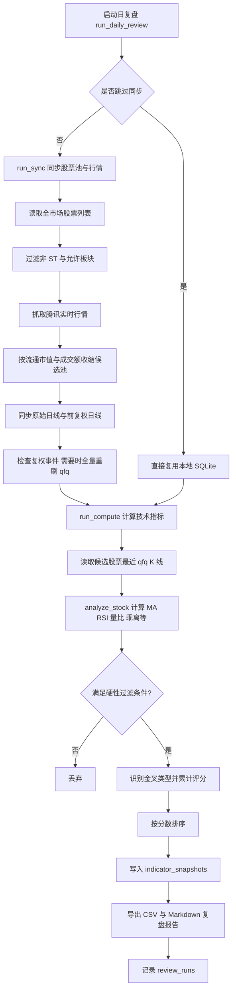
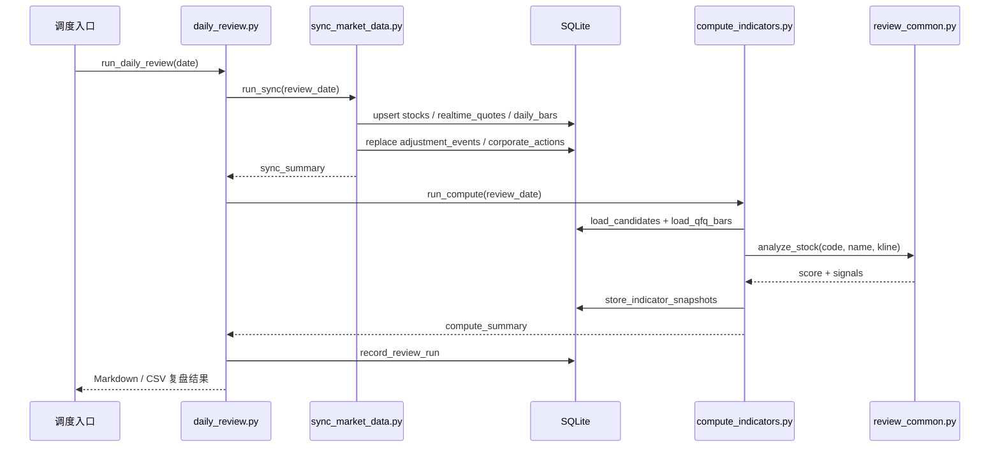

# 选股策略

## 文档目的

本文档基于当前 `stock` 目录下的日复盘实现整理，描述每日选股任务的业务思路、关键筛选条件、评分逻辑以及主流程 UML，便于后续维护、调参与扩展。

当前实现的主入口是：

- `daily_review.py`：编排每日任务，输出 Markdown 和 CSV 复盘结果。
- `sync_market_data.py`：同步股票池、实时行情、K 线和复权事件到 SQLite。
- `compute_indicators.py`：从 SQLite 读取候选股，计算技术指标并生成信号。
- `review_common.py`：集中维护筛选参数、指标计算和评分逻辑。

## 选股思路

### 1. 先做交易宇宙收缩

系统不会直接对全市场做技术评分，而是先把股票池收缩到更适合短线或波段跟踪的一组标的：

1. 从全市场 A 股列表读取股票代码、名称、板块信息。
1. 剔除 ST 与 `*ST` 股票。
1. 默认仅保留主板沪市、主板深市、中小板。
1. 使用实时行情过滤流通市值和成交额。

当前默认过滤阈值：

| 维度 | 条件 |
| --- | --- |
| 板块范围 | 主板-沪（60）、主板-深（00）、中小板（002/003） |
| ST 过滤 | 必须为非 ST |
| 流通市值 | 50 亿到 2000 亿 |
| 当日成交额 | 不低于 5000 万 |

这一步的目标不是直接选出买点，而是先排除流动性不足、题材风格不匹配、或者交易噪声较大的标的。

### 2. 再校正历史行情质量

进入候选池的股票会同步两套行情：

1. 原始日线。
1. 前复权日线。

同时系统会拉取前复权因子事件和分红明细，对比本地数据库中的复权事件；如果发现复权因子发生变化，就触发该股票的前复权历史全量重刷。

这一步的核心目的是避免技术指标因为复权不一致而失真，尤其是均线金叉、60 日高点距离、RSI 等指标都会受到历史价格序列质量影响。

### 3. 最后只对“趋势刚形成”的股票打分

策略不是做低吸埋伏，也不是追高强趋势，而是偏向寻找“刚完成启动确认”的标的。核心特征是：

1. 短期均线已经上穿中期均线。
1. 金叉发生时间不能过久，避免追已经走远的趋势。
1. 需要一定的量能配合。
1. 价格不能偏离中期均线过大。
1. RSI 不能过热。
1. 若形成多头排列和较强均线夹角，会获得更高评分。

从实际风格上看，这是一套“中等流动性股票 + 近期金叉 + 放量确认 + 不追过热”的趋势确认策略。

## 技术筛选条件

### 硬性淘汰条件

股票只要命中以下任一条件，就不会进入最终信号列表：

| 条件 | 说明 |
| --- | --- |
| K 线不足 | 历史数据不足以支撑均线和 RSI 计算 |
| `MA5 <= MA20` | 尚未形成短中期多头关系 |
| 未识别到近 10 日有效金叉 | 不是当前关注的启动阶段 |
| 相对 `MA20` 乖离 `> 10%` | 已明显偏离，不追高 |
| `RSI > 75` | 动能过热 |

### 金叉类型识别

系统把金叉分成三类：

| 类型 | 判定逻辑 | 含义 |
| --- | --- | --- |
| 首次金叉 | 近 10 日内发生 `MA5` 上穿 `MA20`，且之前 30 日内未出现死叉回踩后的再次金叉结构 | 趋势初启，优先级最高 |
| 二次金叉 | 近 10 日内发生金叉，且向前追溯曾出现过一次死叉后再转强 | 二次攻击，强于普通回抽 |
| 高位金叉 | 金叉虽成立，但当前价距离近 60 日低点涨幅已超过 30% | 趋势已走出较大空间，降低权重 |

### 趋势与动能辅助条件

除金叉外，还会进一步衡量下列维度：

| 维度 | 判定逻辑 | 作用 |
| --- | --- | --- |
| 多头排列 | `MA5 > MA10 > MA20 > MA60` | 判断中短期趋势是否协调 |
| 缩量回踩 | 追溯 60 天内至少出现 2 次下跌日，且成交量明显低于 60 天均量并低于前一日 | 判断回调抛压是否收敛 |
| 量能 | 当日成交额对比前 20 日平均成交额，量比越大加分越多，不再因为低于固定阈值直接过滤 | 判断上涨是否被资金确认 |
| 突破放量约束 | 若当前信号依赖前面的缩量回踩结构，则当日成交量必须达到这些缩量下跌日成交量的 2 倍以上 | 确认金叉突破不是弱反弹 |
| 均线夹角 | 对 `MA5` 与 `MA20` 的斜率差做角度近似 | 判断趋势抬升速度 |
| RSI | 优先 40 到 60 区间 | 偏好健康强势而不是极端超买 |
| 乖离率 | 优先小于 5%，可接受小于 10% | 控制追高风险 |
| 距离 60 日高点空间 | 作为观察指标输出 | 便于人工判断上方压力 |

### 去重修正与前高压力

当前策略默认不再直接使用原始累计分，而是使用一套 `dedup` 评分：

1. `金叉类型` 作为基础分保留。
1. `趋势确认类信号`（缩量回踩、量能、多头排列、均线夹角）做分组封顶，避免重复加分把同一类趋势特征无限放大。
1. `位置质量类信号`（RSI、乖离率）也做分组封顶。
1. 对距离 60 日高点过近的标的追加前高压力惩罚。
1. 若前面存在有效缩量下跌结构，则要求信号当日成交量至少达到这些缩量下跌日成交量的 2 倍，否则直接过滤。
1. `dedup` 模式下设置最低置信分门槛，低于门槛的信号不进入最终名单。

当前默认参数：

| 项目 | 当前值 |
| --- | --- |
| 趋势确认分组封顶 | 30 |
| 位置质量分组封顶 | 10 |
| 前高压力过近 | 距离 60 日高点空间 `< 10%`，减 15 分 |
| 前高压力偏大 | 距离 60 日高点空间 `< 20%`，减 8 分 |
| `dedup` 最低置信分 | 85 |

## 评分规则

最终结果按综合评分倒序排序。当前代码中的主要加分项如下：

| 信号 | 分值 |
| --- | --- |
| 首次金叉 | 50 |
| 二次金叉 | 35 |
| 高位金叉 | 10 |
| 多头排列 | 15 |
| 60 日内两次缩量下跌 | 30 |
| 轻度放量（量比 `>= 0.7`） | 5 |
| 放量突破（量比 `>= 1.5`） | 25 |
| 温和放量（量比 `>= 1.0`） | 15 |
| 强放量突破（量比 `>= 2.0`） | 35 |
| 强势夹角（角度 `> 15°`） | 20 |
| 温和夹角（角度 `> 5°`） | 10 |
| RSI 健康（40 到 60） | 10 |
| RSI 可接受（30 到 75） | 5 |
| 低乖离（`< 5%`） | 10 |
| 乖离适中（`< 10%`） | 5 |

可以把这套打分理解为：

1. 金叉类型决定基础优先级。
1. 缩量回踩、量能、夹角、多头排列决定趋势是否被确认，但在 `dedup` 模式下会做分组封顶。
1. RSI 和乖离率决定当前位置是否适合介入，并与前高压力一起决定是否保留该信号。

## 执行流程 UML

## 回测交易规则

当前回测默认使用以下交易规则：

| 规则 | 当前值 |
| --- | --- |
| 买点 | 信号当日收盘价，尾盘买入 |
| 止损 | 本金回撤 10% |
| 止盈 | 只按收盘价口径统计历史最大浮盈；必须先在此前某个收盘出现正浮盈，后续收盘浮盈第一次回撤到该最大浮盈的 30% 即卖出 |
| 止盈后冷却 | 同一只股票止盈卖出后 30 天内不再买入 |

这意味着策略现在更偏向“尽早兑现阶段性利润”，并主动避免对刚止盈过的同一只股票在短周期内反复追入。

### 总体活动图

### 核心模块时序图

## 维护建议

### 参数调优优先级

如果后续要优化策略，建议优先调以下参数：

1. `MIN_FLOAT_MV`、`MAX_FLOAT_MV`：决定标的风格。
1. `MIN_DAILY_AMOUNT`：决定流动性门槛。
1. `MAX_BIAS_RATIO`、`MAX_RSI`：决定是否追高。
1. `VOLUME_BREAKOUT`、`VOLUME_MODERATE`：决定放量确认强度。
1. 金叉时间窗口和评分权重：决定策略更偏“首板启动”还是“趋势延续”。

### 当前策略定位

从代码实现看，该策略更适合：

- 用于每日盘后快速筛出值得复盘的趋势股名单。
- 作为人工复核前的第一层量化初筛。
- 与题材、财务、消息面策略叠加，而不是单独作为自动交易信号。

不太适合：

- 极短线打板。
- 纯价值风格选股。
- 不做复权校验的粗糙历史回测。